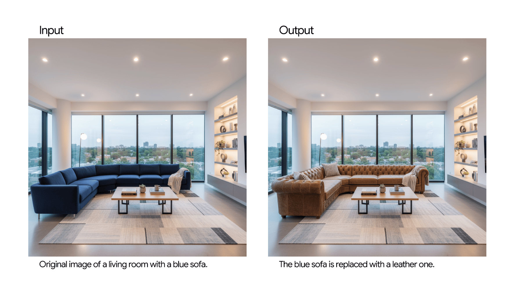

# Image Editing Prompt Templates

## 1. Selective Element Replacement

### Template Structure
```
Using the provided image, change only the [specific element] 
to [new element/description]. Keep everything else in the image 
exactly the same, preserving the original style, lighting, 
and composition.
```

### Example Usage
**Prompt:**
> Using the provided image of a living room, change only the blue sofa 
> to be a vintage, brown leather chesterfield sofa. Keep the rest of 
> the room, including the pillows on the sofa and the lighting, unchanged.

### Visual Reference


---

### Tips for Better Results
- Be specific about what element to change
- Describe the replacement in detail
- Emphasize preservation of other elements
- Mention style consistency requirements