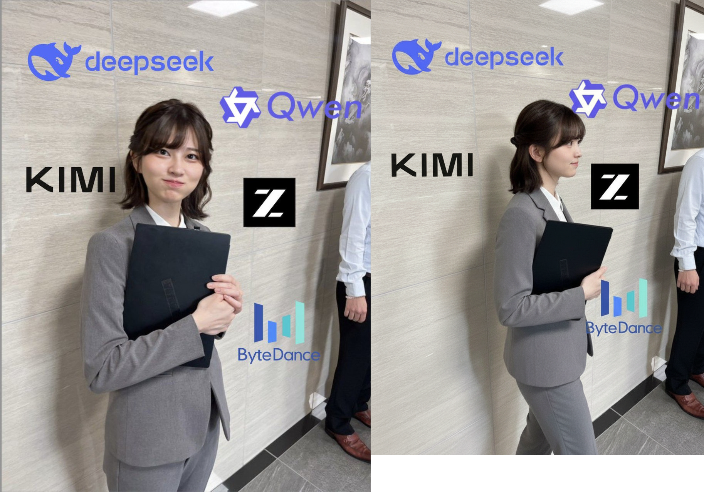

# Nano Banana Hackathon

Welcome to the Nano Banana Hackathon project documentation!

{ width="600" }
<div>
  <p>Here's an SVG:</p>
  <svg>
    <circle cx="50" cy="50" r="40" />
  </svg>
</div>
## What is Nano Banana?

Nano Banana is powered by **gemini-2.5-flash-image-preview**, a powerful new model for advanced image editing and generation.

## Project Overview

This project showcases innovative applications using Gemini 2.5 Flash Image features for the hackathon, focusing on:

- **Dynamic storytelling** with consistent character comics
- **E-commerce applications** like virtual room placement
- **Creative workflow automation** for personalized marketing assets
- **Next-generation natural language photo editors**

## Key Features

- Video frame generation and continuation
- Advanced image processing with Gemini 2.5 Flash Image
- Configurable generation parameters
- Environment-based configuration

## Quick Start

```bash
# Install dependencies
uv sync

# Set up environment
cp .env.example .env
# Edit .env and add your GEMINI_API_KEY

# Run the demo
uv run src/demo_google_api/test_1.py
```

## Documentation Structure

- **Getting Started**: Setup and installation guide
- **API Reference**: Detailed API documentation
- **Examples**: Code examples and tutorials
- **Contributing**: How to contribute to the project